    Выполнение основной части

    1. Запустил плейбук командой ansible-playbook site.yml -i ./inventory/test.yml 

    Вывод команды
   
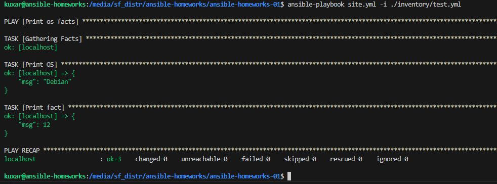

    2. Замену произвел 

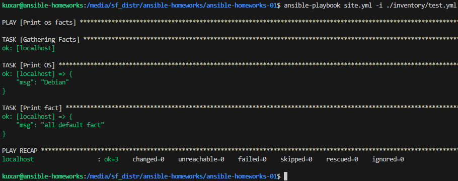

    3. Создал два контейнера 

docker run --name=ubuntu -itd ubuntu (Необходимо было до установить "apt install python3")
docker run --name=centos7 -itd centos

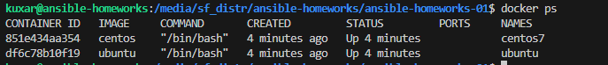

    4. Запустил плейбук командой ansible-playbook site.yml -i ./inventory/prod.yml
   
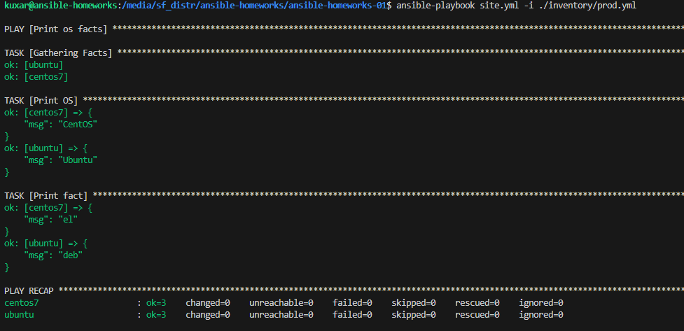

    5-6. Замену произвел

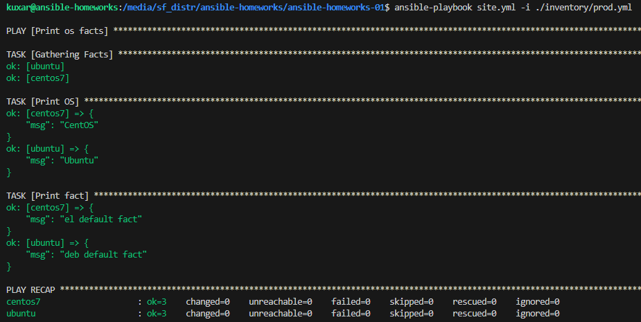

    7. Зашифровал факты 
   
 ansible-vault encrypt ./group_vars/deb/examp.yml
 ansible-vault encrypt ./group_vars/el/examp.yml

    8. Запустил плейбук с зашифрованными фактами командой 
   
ansible-playbook site.yml -i ./inventory/prod.yml --ask-vault-pass

вывод команды

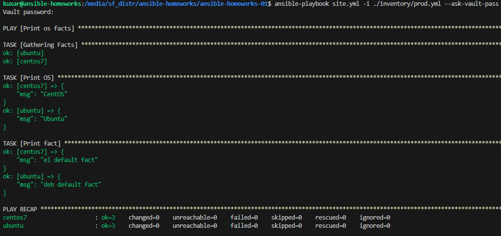

    9. Команда "ansible-doc -l" выводит список всех доступных плагинов
       команда "ansible-doc (модуль)" выводит информацию как работать с указанным модулем

    10-11. Запустил измененный плейбук командой ansible-playbook site.yml -i ./inventory/prod.yml

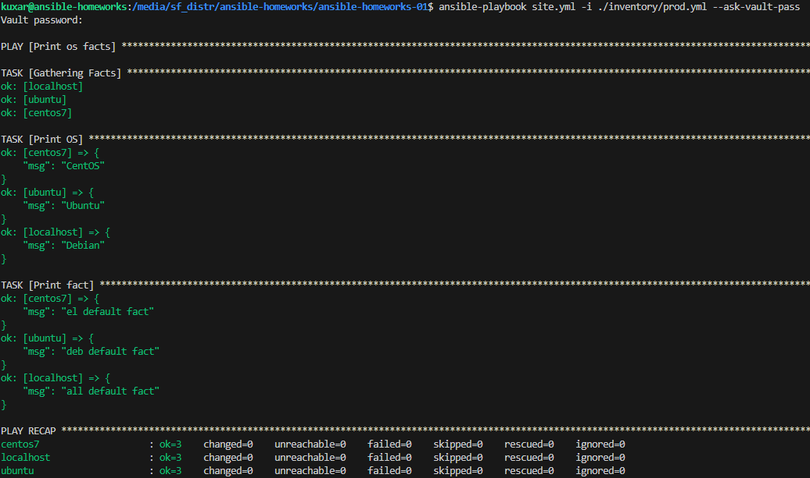

    Доп.Задание

    1. ansible-vault decrypt

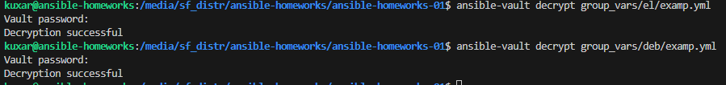

    2. Зашифровываем значение переменной командой 
    ansible-vault encrypt_string 'PaSSw0rd' --name 'pas'
    и добавляем ее в в файл group_vars/all/exmp.yml
   
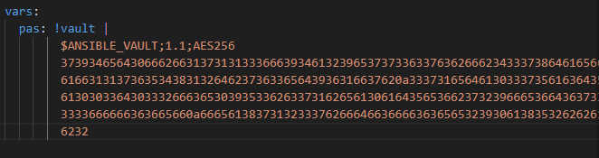

    3. ansible-playbook site.yml -i ./inventory/prod.yml --ask-vault-pass
    
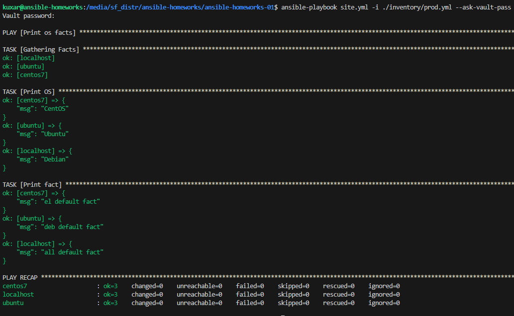

    4. Установил федору у прописал ее в site.yml
        ansible-playbook site.yml -i ./inventory/prod.yml

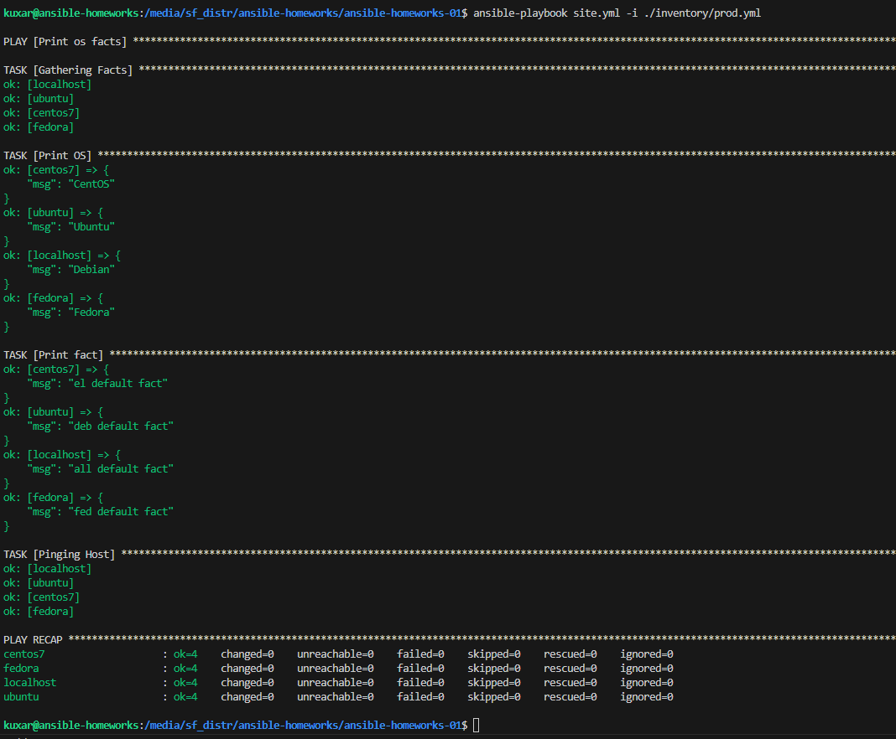

    5. Вернусь позже как разберусь в написании скрипта на bash